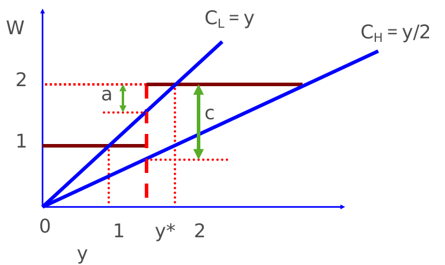
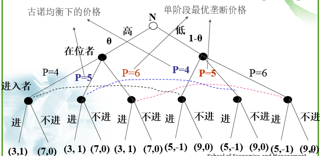

#6.3 信号传递

##6.3.1 斯宾斯劳动力市场模型

###信号传递过程

>1.求职者行动，决定自己的受教育程度并传递给雇主，求职者支付相应的信号传递或示意成本。

>2.雇主行动，观察到求职者受教育程度的高低，并根据受教育程度与实际能力之间相关程度的概率判断，决定雇员工资水平。

###信号传递纳什均衡的条件

>1.在存在信号传递成本和对不同教育水平的劳动力实行不同的工资待遇的情况下，求职者没有动机去改变他们的信号传递决策。

>2.雇主认为自己对信号的判断是正确的，而且雇主制定的工资水平总是使自己获得预期的正常利润。

##6.3.2 分离均衡

背景条件

>假设雇主和求职者都是风险中性的，求职者受教育程度可以用y来表示，并且假设两种类型的求职者存在：

>1.L型：生产能力PL＝1，在人群中的比重＝q，其接受教育的成本是：CL＝y

>2.H型：生产能力PH＝2，在人群中的比重＝1－q，其接受教育的成本是：CH＝1/2 y

在完全信息情况下

>雇主可以观察到每个工人的生产能力的高低，所以他们支付给每个工人的工资等于工人的边际产出：WL= PL =1 WH= PH =2

在不完全信息并且无信号传递情况下

>支付给每个工人同样的工资,工资W由所有求职者的加权平均的生产能力来决定：**W＝PLq+PH(1-q)=q+2(1-q)=2-q**

雇主对教育程度的评价

>雇主认为受过某个特别水平的教育，我们称之为y*，及受过比这个水平更高的教育的工人都是高素质的工人，其他的工人是低素质的。

>1.当y<y*时，雇主认为该工人是L型，支付W＝1的工资；
>2.当y>y*时，雇主认为该工人为H型，支付W＝2的工资。(这里假设y*>1)

**分离均衡的结论**

1.**分离均衡**

>不同类别的人采取不同的行动，做出不同的选择。（分离均衡是唯一能实现市场效率的均衡）
L型和H 型求职者被清楚地区分开来，L型不会选择y=y*，H型也不会选择y=0。

2.**均衡的结果不唯一**

>只要雇主的信念是任何位于1和2之间的y*值，都会出现分离均衡的结果，因此实际上有无穷多个结果。

3.**不同均衡结果，L型和H型求职者处境不同**

>雇主的信念y*越靠近2，H型求职者的处境就越坏(净收益＝2－y*/2)，而L型求职者的境况始终不受影响。而雇主则始终获得正常利润。y*越接近1，均衡结果越优。

4.**与完全信息的均衡结果比较**

>完全信息下，求职不用支付信号传递成本，但却得到了与信号传递下一样的工资：WL=1，WH=2。在不完全信息下，求职者因支付信号传递成本而降低了福利水平。

5.**与不完全信息无信号传递成本比较**

>在这种情况下，L型和H型工人的工资是一样的W=2-q。因为q介于0和1之间，W就介于1和2之间。在无信号传递下，L型工人的状况得到了改善，而H型工人正好相反。

6.**雇主始终获得正常利润**

>雇主无所谓。一旦参与人处于其中某个纳什均衡之中，就没有任何人可以通过单方面的力量跳出这个均衡回到其他状态，即“路径依赖”。

##6.3.3 混同均衡

定义

>所有人都采取同样的行动，做出同样的选择。混同均衡将导致逆向选择.

解决方案

>雇主根据不同的教育水平，给出多种（教育水平，薪酬水平）组合，劳动者根据自己的能力选择。从而“分离均衡”。

##6.3.4 信号传递方式

1.市场进入阻挠博弈

>在位者知道自然的选择（自己的类型），进入者能观测到在位者的价格选择，但不能观测到在位者的成本函数。价格选择是一种信号。完全信息条件下，若在位者高成本——“进入”；若在位者低成本——不进入

2.广告

>消费者对于其熟悉的某些产品的广告更敏感。厂商都对同一产品大做广告，以期消费者对这些产品的广告更为敏感，并在此基础上改变或影响消费者的消费偏好和消费水平。

3.企业拆借

>真正好的公司通过向银行借钱来增大自己**破产**的可能性，令其它实际上不好的公司难以模仿。这种负债比例的增加要做到恰到好处，它既可令其它实力稍弱的公司难以模仿，又使自己能够承受。公众识别出好的公司以后竞相购买股票，导致公司股票价格上涨，结果这家负债公司会因其股价上涨而获资本增值，破产的可能性下降。

##6.3.5 常见的信号传递方法

>**代理人**用增加交易费用（鉴定书、鉴定窗口、信誉等）的方法消除双方的信息不对称，进而解决**逆向选择**和**市场失灵**问题。
