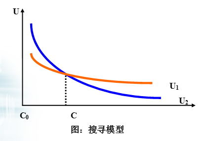

#8.2 信息搜寻原理

***

##8.2.1 信息搜寻的假设前提

>消费者知道市场上价格的**整体分布情况**，但不知道每个销售商的价格。

##8.2.2 搜寻类型

1.**固定样本搜寻**（限定次数）

>预先选定几个销售商，寻找其中的最低价格.

2.**连续搜寻**（保留价格）

>在市场上连续不断地搜寻，直至搜寻到愿意接受的价格。

##8.2.3 搜寻方式

**1.交易区域化**

>最为古老的搜寻方式之一。 

**2.专业化贸易商**

>潜在的买卖者通过专业化贸易商的集中化专业贸易活动得到相互需要的市场信息。

**3.广告**

>特别是分类广告，是买卖双方相互交换信息的现代方式，也是现代人信息搜寻的主要方式。

**4.信息资源共享**

**5.直接走访**

>如走访商店，市场行情实地调研等。 

**6.专业或非专业化信息机构或个体**

>信息公司、职业介绍所、婚姻介绍所和专业咨询公司等机构，自由信息经纪人，媒婆或红娘等。

**7.通讯搜寻**

>如电话咨询、函件、网络搜寻等。

##8.2.4 搜寻的经济学分析

搜寻具有成本，包括直接成本和间接成本。因此，最佳搜寻次数（或规模）由搜寻成本和搜寻的预期收益之间的相关关系决定。在MR＝MC处，达到搜寻的最佳收益。 

>1.购买的商品价格越高，搜寻次数就越多；
>
>2.市场范围越大，搜寻成本就越高；
>
>3.价格离散率越高，搜寻的收益就越大；
>
>4.搜寻的密度越大，价格离散率就越低；

##8.2.5 基本模型

假设前提

>假定决策者对已知选择范围的概率分布具有完全信息，但对具体的每个选择却没有完全信息。

场景

>设某市场M中有一商品Q正常单价为p，而且M中部分商店对每件商品都给予d的折扣。假设不给予折扣的商店的比例为q。买主走访商店的成本为c，每次搜寻都承当着U(-c)<0的负效用。

所有可能的结果

1.买主没有购买

>买主承担U(-c)的负效用

2.买主无折扣的用p购买商品

>买主的的效用为U(-c)+U(-p),其中U(-p)>0

3.买主买到含有折扣d的商品

>买主的总效用为U(-c)+U(-p+d),其中U(-p)<U(-p+d)

买主的选择

1.无论是否有折扣，买主只走访一家商店并购买。

>**效用U(1)= U(-c)+[qU(-p)+(1-q)U(-p+d)]****

2.走访一家商店只在有折扣时才购买，否则，走访第二家商店并且无论第二家有无折扣都购买。

>**效用U(2)=U(-c)+(1-q)U(-p+d)]+q[U(-c)+qU(-p)+(1-q)U(-p+d)]**

如果p、q和d有一定数值，买主采取的行动取决于搜寻成本c的大小，

