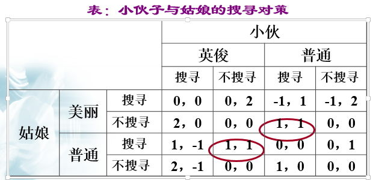

# 8.3 搜寻与战略地位

***

> 个体是否采取搜寻行动，一方面与个体的边际搜寻成本有关;另一方面,与个体所处的对策战略地位有关。

###案例1

>美丽动人的姑娘身边常伴着其貌不扬的小伙子,魁梧英俊的小伙子往往找相貌平平的姑娘。

>>假设在同等条件下，美丽的姑娘搜寻的机会成本高于相貌普通的姑娘，为简单化，假设后者为1时，前者为2；同样，英俊小伙子搜寻的机会成本也高于相貌普通的小伙子，假设后者为1时，前者为2。又假设找到相貌美丽或英俊的伴侣的收益为2，找到相貌普通的伴侣的收益为1。

> 以美丽姑娘的角度考虑，她的最优选择必然是不搜寻，等待相貌普通的小伙子的搜寻。
> 
> 以相貌普通的小伙子的角度考虑，他与美丽姑娘对局的预期收益最高，则他会主动搜寻美丽姑娘。
> 
> 双方都将这种策略看作为最优策略，因而就会出现稳定均衡。另一种稳定均衡出现在相貌普通的姑娘主动搜寻英俊小伙子的情形中。

